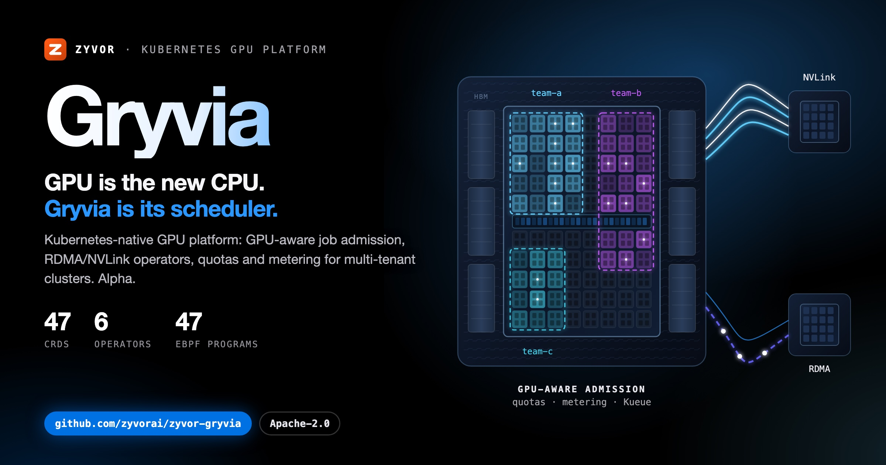
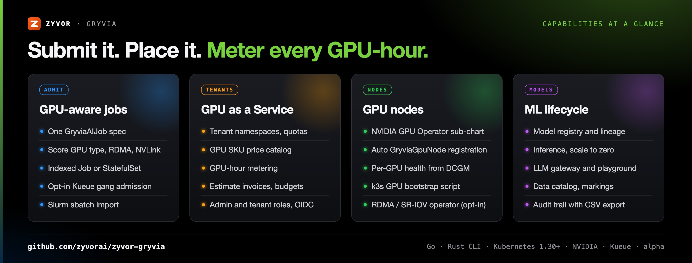
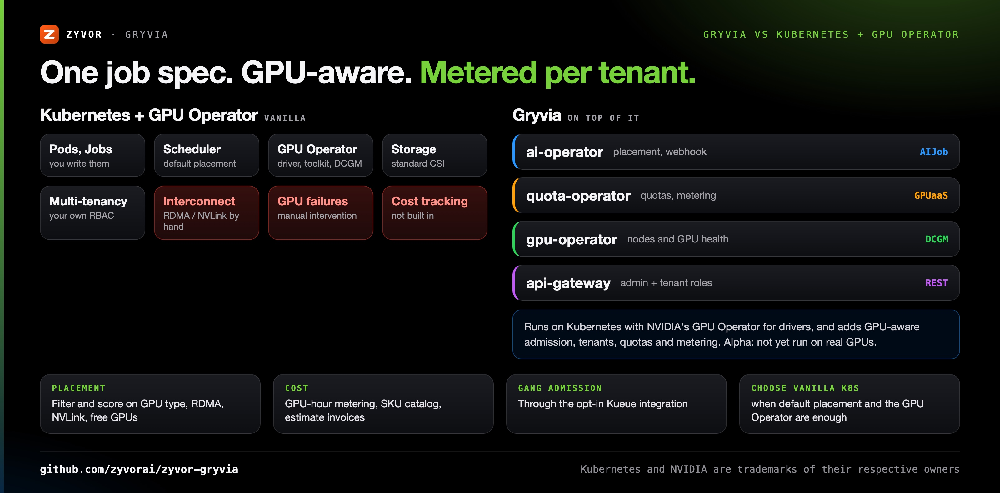
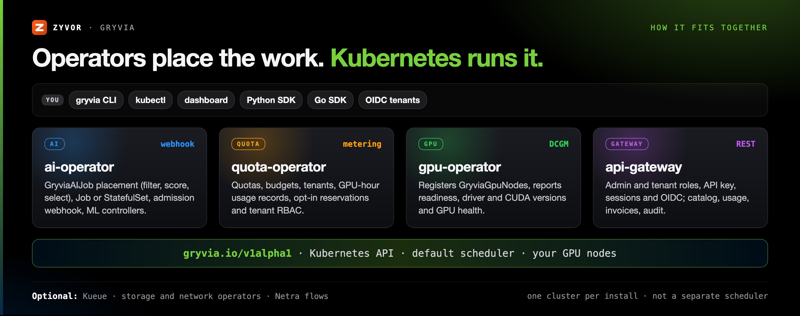

<div align="center">

# Gryvia

[](LICENSE)
[](https://go.dev/)
[](https://kubernetes.io/)
[](https://nvidia.com)

[](https://zyvor.dev/schedule?utm_source=github&utm_medium=gryvia&utm_campaign=readme_hero)
[](https://zyvor.dev/poc?utm_source=github&utm_medium=gryvia&utm_campaign=readme_hero)
[](#quickstart)



### GPU is the new CPU. Gryvia is its scheduler.

**A Kubernetes-native GPU platform for teams training large models.** GPU-aware job admission, RDMA/NVLink and parallel-filesystem operators, quotas and budgets, and a multi-tenant GPU service with a price catalog and metering, so placement is handled by operators instead of hand-tuned per cluster.

**GPU-aware job admission** · **6 Kubernetes operators** · **49 CRDs** · **Opt-in Kueue gang admission** · **Try it on kind, no GPUs**

[**Quickstart**](#quickstart) · [**Docs**](website/docs/intro.md) · [**Architecture**](#architecture) · [**Demo**](#try-it-in-five-minutes-no-gpus) · [**License**](#license)

</div>

---

> **Status: alpha, under active development.** Much of the platform is implemented and unit-tested, but the GPU,
> RDMA and eBPF paths have not been run on real hardware, and part of the CRD surface is design only.
> [What works today](#what-works-today) says which is which. Performance figures in this repository are
> design targets, not measured results — see [Performance Metrics](#performance-metrics).

## What's new

From the Unreleased section of the [changelog](CHANGELOG.md); each entry there says how it was tested.

| Feature | What it does |
|---|---|
| **Workload intelligence** | A dashboard workbench and typed analysis APIs for preflight, training evidence, useful-work cost, inference SLO recommendations, model benchmarking, checkpoint compatibility, locality, fabric qualification, capacity simulation and sovereign placement. Opt-in operations add durable proposals, separate OIDC review, execution preconditions and rollback ([guide](docs/workload-intelligence.md)) |
| **Operator copilot** | `POST /api/copilot/chat` and a dashboard page answer plain-language questions about jobs, models, datasets, inference services and lineage over five read-only tools, with the caller's own LLM key |
| **Data catalog and markings** | Document and search `GryviaDataset`s (owner, tags, column schema); label-based markings hide datasets and models from users outside the marking's OIDC group |
| **Lineage and audit** | `GET /api/lineage` draws dataset → job → model → inference service; the gateway audit trail can be durable on SQLite with filters and CSV export |
| **Production promotion approval** | Opt-in: a tenant's promote-to-production waits for a provider admin to approve or reject it |
| **Scale to zero** | `GryviaInferenceService.spec.scaleToZero`, with an LLM gateway activator that wakes an idle model on the next request |
| **Slurm on Kubernetes** | Opt-in Slinky slurm-operator sub-chart, per-tenant partitions, and `gryvia submit --sbatch` to import Slurm batch scripts |
| **Playground** | Chat with any ready model on the LLM gateway from the dashboard, with the settings as curl or OpenAI Python code |

## Why Gryvia

| When this happens… | Gryvia gives you… |
|---|---|
| GPUs sit idle or fragmented because placement ignores GPU type and interconnect | The ai-operator filters and scores nodes on GPU type, RDMA/SR-IOV, NVLink/NVSwitch, free GPUs and memory, and records its choice in the job status |
| Every training job is a hand-written set of Pods, Services and PVCs | One `GryviaAIJob` (type, gpus, gpuType, distributed); the operator creates the Indexed Job or StatefulSet, the headless Service and the PVC |
| Multi-node jobs need all-or-nothing admission and fair sharing | Gang admission, quota borrowing and priority preemption through the opt-in Kueue integration |
| Several teams share one GPU cluster and nobody knows who used what | Tenants, per-team quotas and budgets, GPU-hour metering, a SKU price catalog and estimate invoices (no payments) |
| Bringing a GPU server into the cluster is a day of driver work | An optional NVIDIA GPU Operator sub-chart, a k3s bootstrap script and automatic `GryviaGpuNode` registration (not yet validated on real GPUs) |
| You need to evaluate before you have GPUs | `scripts/kind-demo.sh` installs Gryvia on kind with fictional demo data |

GPU-type-, interconnect- and quota-aware job admission to reduce idle and fragmented GPUs; hardware access without a
virtualization layer; per-tenant cost visibility; Kubernetes-native operators and CRDs built for platform teams; open
source under Apache 2.0.



## The problem, the shape of the fix

Modern AI infrastructure is broken in a specific way: GPUs sit idle from poor scheduling and
fragmentation, distributed training is slow because network bottlenecks kill multi-node scaling,
storage can't keep up with data loading, and teams burn weeks hand-tuning NCCL, RDMA, drivers and
topology before training even starts. No single platform ties GPU scheduling, networking, storage
and observability together.

Gryvia is a Kubernetes-native GPU platform. The goal: submit a job and have GPU-aware placement, RDMA/NVLink
configuration and parallel-filesystem storage handled by operators instead of hand-tuned per cluster, and run the
cluster as a multi-tenant GPU service with a price catalog and metering. Built for teams training large models, not
running containers. It is early: see [What works today](#what-works-today) before relying on any of it.

<table width="100%">
<tr>
<td valign="top" width="33%">

**GPU-aware admission of jobs**<br>
Jobs are checked and scored against GPU type, RDMA/SR-IOV labels, NVLink/NVSwitch interconnect and free GPUs, then run
as an Indexed batch Job (training, fine-tuning, evaluation: they complete) or a StatefulSet (inference), pinned by node
selector. Gang admission, quota borrowing and priority preemption come from the opt-in Kueue integration (off by default;
kind e2e passes in CI with real Kueue and CPU pods, nothing on GPUs); the operator has no in-tree gang, DRF or preemption scheduler.<br>
[Scheduling guide](website/docs/guides/SCHEDULING.md)

</td>
<td valign="top" width="33%">

**GPU as a Service**<br>
Tenants with isolated namespaces, a GPU SKU price catalog, per-job metering and estimate invoices, with provider
(admin) and tenant roles in the gateway. Estimates only: no payments.<br>
[GPU as a Service](website/docs/guides/GPU_AS_A_SERVICE.md)

</td>
<td valign="top" width="33%">

**GPU nodes that prepare themselves**<br>
An optional NVIDIA GPU Operator sub-chart, a k3s bootstrap script, and automatic `GryviaGpuNode` registration from
NVIDIA feature-discovery labels. Not yet validated on real GPUs.<br>
[GPU nodes](website/docs/guides/GPU_NODES.md)

</td>
</tr>
<tr>
<td valign="top" width="33%">

**Six Kubernetes operators**<br>
GPU, AI workload and quota operators (plus optional storage and network operators for RDMA/SR-IOV and
parallel-filesystem CSI backends) in the main chart; network intelligence in its own. 43 of the 49 CRDs have a
registered runtime controller (some are opt-in).<br>
[Core components](#core-components)

</td>
<td valign="top" width="33%">

**Network Intelligence (NetPredator) and eBPF**<br>
Experimental. 47 CO-RE eBPF programs and a privileged collector (off by default), a node-local Flight Recorder, and
an operator whose Cilium policy actions are real but whose live measurements are not wired. Real flows can come from
Netra.<br>
[Network Intelligence guide](website/docs/guides/NETWORK_INTELLIGENCE.md)

</td>
<td valign="top" width="33%">

**CLI, Python SDK, Go SDK**<br>
A Rust CLI (`gryvia`) that reads the cluster through your kubeconfig, a Python SDK for the gateway REST API and a Go SDK
for the custom resources.<br>
[CLI guide](website/docs/guides/CLI_GUIDE.md) · [API reference](website/docs/developer-guide/api-reference.md)

</td>
</tr>
</table>

---

## Gryvia vs Kubernetes + GPU Operator



Gryvia runs on Kubernetes and uses NVIDIA's GPU Operator for drivers; this is what it adds on top.

| Capability | Vanilla K8s + GPU Operator | Gryvia today |
|---|---|---|
| Job spec | Pods, Jobs and StatefulSets you write | One `GryviaAIJob` (type, gpus, gpuType, distributed); the operator creates an Indexed Job (or a StatefulSet for inference), the headless Service and the PVC |
| Job placement | Default scheduler (first-fit) | The operator filters and scores nodes (GPU type, RDMA/SR-IOV, NVLink, free GPUs, memory) and records the choice in the job status; pods are pinned by node selector and placed by the default scheduler. Gang admission needs the opt-in Kueue integration (kind e2e with CPU pods passes in CI; not run on GPUs); the operator's own gang scheduler is library code. A single job is already placed all-or-nothing; the opt-in `--placement-holds` keeps jobs placed at the same moment from counting the same free GPUs (advisory: pods are not pinned to the chosen nodes) |
| RDMA/NVLink setup | Manual | Network operator (optional) creates device plugins and Multus attachments; unverified on hardware |
| Storage for training | Standard CSI | Storage operator (optional) for VAST, Weka, DDN, Lustre and CephFS backends; unverified on real storage |
| GPU failure handling | Manual intervention | Node readiness and per-GPU health on `GryviaGpuNode` (DCGM); no automated remediation |
| Cost tracking | Not built in | GPU-hour metering, SKU catalog, estimate invoices, per-team `GryviaQuota` and `GryviaBudget` budgets (opt-in admission gate that rejects on estimated spend; estimates only); actual-usage chargeback estimates; no payments |
| Multi-tenancy | Namespaces and your own RBAC | `GryviaTenant` namespaces with quota and NetworkPolicy; isolation is enforced by the gateway, plus opt-in per-tenant RoleBindings (`quotaOperator.tenantRbac`, unverified against a real identity provider) |
| **Choose vanilla Kubernetes when** | Default placement and the GPU Operator are enough, you do not need tenants or metering, and you would rather not run alpha software in the GPU path | |

<a id="gryvia-vs-vanilla-kubernetes"></a>

---

## How it fits together



### Architecture

```
 kubectl · gryvia CLI ─────────────────────────────┐
 Dashboard ──▶ API gateway (admin | tenant roles) ─┤──▶  Kubernetes API  (gryvia.io/v1alpha1 CRDs)
 Python SDK ──▶ API gateway      Go SDK ───────────┘            │
                                                                ▼
   Operators (helm/gryvia):  gpu · ai (+ admission webhook) · quota · [storage] · [network]
   Operator (helm/network-intelligence):  network-intelligence
                                                                │
   GPU nodes:  NVIDIA GPU Operator (optional) ─▶ node labels ─▶ GryviaGpuNode (auto-registered)
   Observability:  DCGM exporter · optional eBPF collector DaemonSet (experimental) · optional Netra flows
```

One cluster is managed per install. Opt-in federation probes verify remote readiness, and native Kueue MultiKueue configuration is available; opt-in federation failover fences a failed member and moves its MultiKueue workloads to another one, resuming from an S3 checkpoint replica ([federation failover](docs/federation-failover.md), kind e2e with CPU pods); GPUs across clusters remain unverified. The GPU-aware scheduling is the ai
operator's node selection (filter, score, select), not a separate scheduler.

### Core Components

<details>
<summary><b>49 CRDs, 43 of them with a runtime controller (the CRD reference has the full table)</b></summary>

**Reconciled by a runtime controller (43; some opt-in).**
GPU operator: `GryviaHealthCheck` (opt-in health/remediation flags), `GryviaGpuNode` (also auto-created from GPU feature-discovery labels), `GryviaGpuMemoryOptimizer`, `GryviaGPUSharingPolicy` (opt-in `--enable-gpu-sharing`, chart `gpuOperator.gpuSharing`: writes the node labels for time-slicing and MIG) ·
AI operator: `GryviaAIJob`, `GryviaCheckpointGuard`, `GryviaLiveExperiment`, `GryviaModelLineage`,
`GryviaTrainingProfiler`, `GryviaTrainingTimeMachine`, and the ML kinds `GryviaWorkspace`, `GryviaInferenceService`,
`GryviaModelRegistry`, `GryviaWorkflow`, `GryviaAutoTuner`, `GryviaPriority`, `GryviaTemplate` (on by default, `--enable-ml-controllers`), plus
`GryviaModelWatch` (only with `--enable-model-watch`, see [Model factory](docs/model-factory.md)), `GryviaVectorIndex` (only with `--enable-rag`, see [RAG](docs/rag.md)), `GryviaAgent` (only with `--enable-agents`, see [Agents](docs/agents.md)), `GryviaJobHook` (only with `--enable-job-hooks`, see [Job hooks](docs/job-hooks.md)), `GryviaFederation` (only with an administrator server allowlist), `GryviaFabricSignal` (only with `--merge-fabric-signals`) · Quota operator: `GryviaQuota`, `GryviaTenant`,
`GryviaUsageRecord`, `GryviaCostPredictor`, `GryviaBudget`, `GryviaChargeback`, `GryviaReservation` (only with `--enable-reservations`) · Storage operator: `GryviaStorage`, `GryviaDataset` (only with `--enable-datasets`, see [Datasets](docs/datasets.md)) · Network operator: `GryviaNetwork` ·
Network-intelligence operator: `GryviaFlowPolicy`, `GryviaTrafficInsight`, `GryviaAutoPolicy`, `GryviaTraceSession`,
`GryviaServiceGraph`, `GryviaNetworkAnomaly`, `GryviaSecurityPolicy`, `GryviaNetworkCost`, `GryviaTrainingInsight`,
`GryviaInferenceInsight`.

**Data kinds without a controller (6).** `GryviaGpuSku`, `GryviaNetworkRate`, `GryviaNetworkUsageRecord` and `GryviaNodeFabric` are catalog/telemetry data read by other controllers. `GryviaLedgerEntry` (appended by the quota-operator for each sealed usage record) and `GryviaInvoice` (written by the API gateway) are the opt-in immutable billing records, see [Billing ledger](docs/billing-ledger.md). The legacy kinds `GryviaAutoScaler`, `GryviaRetryPolicy`, `GryviaSLA`, `GryviaAudit`, `GryviaQuotaPolicy`, `GryviaMetric`, `GryviaBenchmark` and `GryviaDRTest`, which never had a runtime, were removed; see the [CHANGELOG](CHANGELOG.md) for the upgrade steps.

</details>

**Six operators:** GPU (registers `GryviaGpuNode`s and reports readiness, driver/CUDA versions and DCGM health; it does
not install drivers, NVIDIA's GPU Operator does) · AI workload (`GryviaAIJob` placement and Job/StatefulSet workloads, the admission
webhook, the ML controllers, an opt-in quota/budget admission gate and Kueue integration, and the profiler,
checkpoint-guard, live-experiment, lineage and time-machine CRDs) · Quota (quotas and
per-namespace budgets, `GryviaBudget`, tenants, usage metering, opt-in node reservations, tenant RBAC and per-tenant Kueue queues) · Storage and Network (optional; parallel-filesystem CSI backends, and
RDMA/SR-IOV device plugins with Multus attachments; hardware-unverified) · Network Intelligence (Cilium policy actions
and insights; its own chart, experimental).

**GPU-aware node selection:** the AI operator lists nodes and their running GPU pods, filters out nodes that are not
ready, have the wrong `gryvia.io/gpu` type, lack the requested RDMA/SR-IOV label or the free GPUs, then scores the rest
(GPU type match +50, RDMA +30, NVSwitch +40 or NVLink +30 for multi-GPU jobs, +5 per free GPU, +1 per 10 GB of GPU
memory, plus CPU/memory) and takes the top `distributed.nodes`. It records that choice in `status.nodesAllocated` (and
keeps the job Pending, retrying every 30 s, when no node qualifies); the workload's pods (Job or StatefulSet) are constrained by node
selector (`gryvia.io/gpu`, `gryvia.io/rdma`, `spec.nodeSelector`) and placed by the default Kubernetes scheduler. The
There is no in-tree gang scheduler, DRF queue or preemption, and elastic training is only partial (`distributed.elastic.minNodes`, unit-tested, no live resize; see docs/elastic-training.md) (Kueue, when its integration is on, does gang admission, borrowing and priority preemption instead; unverified on a cluster), and the standalone NVLink/NUMA
topology optimizer in `scheduler/` is not called by the running operator. Opt-in fabric-aware ranking (`--fabric-aware-scheduling`, chart `aiOperator.fabricAwareScheduling`, or the per-job annotation `gryvia.io/fabric-aware`) subtracts up to 25 points from nodes whose fresh `GryviaNodeFabric` signal reports a sick fabric; it is off by default, unit-tested, and never run on a real fabric. Detail:
[Scheduling guide](website/docs/guides/SCHEDULING.md).

---

## Quickstart

Requirements: a Kubernetes 1.30+ cluster and Helm for an install; [kind](https://kind.sigs.k8s.io) (with a container runtime) and `kubectl` for the demo. The CLI builds with `cargo build --release` in `cli/`.

### Try it in five minutes (no GPUs)

`scripts/kind-demo.sh` creates a local [kind](https://kind.sigs.k8s.io) cluster, installs Gryvia and loads
**fictional** demo data (GPU nodes, a quota, a job) so you can explore the dashboard without hardware:

```bash
git clone https://github.com/zyvorai/zyvor-gryvia && cd gryvia
./scripts/kind-demo.sh
kubectl -n gryvia-system port-forward svc/gryvia-ui 8443:443   # https://localhost:8443
```

Sign in as `admin` / `Admin@321`. That is a well-known lab key: set your own (`auth.apiKey`) before sharing
an install; the sign-in page shows the `kubectl` command that reads the key in use. See [Authentication and TLS](website/docs/guides/AUTH_AND_TLS.md). The demo's GPU nodes are fictional:
nothing runs real GPU work.

### Install on your cluster

```bash
helm install gryvia oci://ghcr.io/zyvorai/charts/gryvia \
  --namespace gryvia-system --create-namespace \
  --set auth.apiKey='a-long-random-secret'
```

The chart installs the CRDs, the GPU, AI workload and quota operators, the API gateway and the dashboard; the storage
and network operators are off by default, and network intelligence is a separate chart. Then submit work with the CLI
or `kubectl` (the CLI needs a kubeconfig; build it with `cargo build --release` in `cli/`, or take a release binary):

```bash
gryvia -n gryvia-system submit --file examples/training/simple-pytorch-training.yaml
gryvia -n gryvia-system list jobs
gryvia status                      # platform report; `gryvia status <job-name>` for one job
```

The example requests storage from a StorageClass named `vast-fast`; edit or remove that line unless you have one. The
dashboard's admin view shows jobs from the gateway's namespace (`gryvia-system` with the chart), hence `-n`.

## GPU servers: drivers, CUDA and the device plugin

On a fresh Ubuntu 22.04/24.04 server with an NVIDIA GPU, one command installs k3s, Gryvia and NVIDIA's GPU Operator
(driver, container toolkit, device plugin, DCGM):

```bash
sudo ./scripts/install-k3s-gpu.sh server
```

On an existing cluster, add `--set nvidia.enabled=true` to the Helm install. Gryvia then registers every GPU node
automatically. It does not install a CNI, Multus or InfiniBand drivers (the script installs k3s itself), and the GPU
path has not yet been validated on real hardware: CI covers the script with dry-run tests and a GPU-less k3s job (see
[docs/gpu-validation.md](docs/gpu-validation.md) for the checklist to run on a real machine). Details:
[GPU nodes](website/docs/guides/GPU_NODES.md) · [Deployment guide](website/docs/guides/DEPLOYMENT_GUIDE.md) ·
[Complete deployment guide](website/docs/guides/COMPLETE_DEPLOYMENT_GUIDE.md). The Terraform and Ansible directories
are experimental and incomplete.

## GPU as a Service

Run the cluster as a multi-tenant GPU cloud: the provider (API key or an OIDC admin group) creates `GryviaTenant`s
(namespace `tenant-<name>` with quota and optional NetworkPolicy) and publishes `GryviaGpuSku` prices; tenants sign in
with OIDC and see only their own jobs, usage and catalog; the quota operator meters GPU hours into `GryviaUsageRecord`s.

```bash
gryvia catalog                         # SKUs and hourly rates
gryvia tenant list
gryvia usage --group-by tenant
gryvia invoice --month 2026-09         # estimate: JSON or CSV, no payments
```

Also in the dashboard (Catalog, Usage, Tenants, Invoices) and under `/api/skus`, `/api/tenants`, `/api/usage`,
`/api/invoices`. It has been tested with unit tests and fake clusters, not against a real identity provider or GPUs.
See [GPU as a Service](website/docs/guides/GPU_AS_A_SERVICE.md), and [GPU cloud platform](docs/gpu-cloud-platform.md)
for what GPU clouds advertise mapped to what Gryvia has and how each part is tested.

---

## Admission and recovery

Optional strict tenant Kueue admission, distributed worker spreading and cooperative checkpoint hooks are described in
[docs/admission-recovery.md](docs/admission-recovery.md). Checkpoint hooks require a compatible trainer and persistent storage; they do not guarantee a save before eviction or node failure.

## Inference serving

Explicit GPU/RPS autoscaling targets use custom per-pod HPA metrics, and opt-in Gateway API routing adds weighted canary traffic and accepted-route promotion gating. Opt-in Prometheus SLO analysis blocks promotion on missing telemetry and rolls back measured error-rate/p95 breaches. These features require external components; see [docs/inference-serving.md](docs/inference-serving.md) for configuration and validation limits.

## Performance Metrics

The only measured numbers are the eBPF collector's overhead on one shared x86 host with loopback traffic
([docs/ebpf-overhead.md](docs/ebpf-overhead.md); a CPU host, nothing about GPU training or inference throughput). No
scheduling, recovery or queue-depth benchmark results are published: the figures below are **design targets**, to be
validated with `benchmarks/suite.yaml` on real hardware before they are quoted as results.

| Metric | Target |
|---|---|
| Job scheduling latency | < 500 ms (8-GPU job) |
| Fault recovery time | < 60 s (node failure) |
| Concurrent queued jobs | 10,000+ |

Storage and network throughput depend on the hardware, filesystem and fabric you deploy on.

---

## Documentation

| Topic | Doc |
|---|---|
| Full documentation index | [website/docs/intro.md](website/docs/intro.md) |
| Quick start | [website/docs/getting-started/quickstart.md](website/docs/getting-started/quickstart.md) |
| Bare-metal / complete deployment | [DEPLOYMENT_GUIDE.md](website/docs/guides/DEPLOYMENT_GUIDE.md) · [COMPLETE_DEPLOYMENT_GUIDE.md](website/docs/guides/COMPLETE_DEPLOYMENT_GUIDE.md) |
| Authentication and TLS | [guides/AUTH_AND_TLS.md](website/docs/guides/AUTH_AND_TLS.md) |
| Cluster setup (admin) | [admin-guide/cluster-setup.md](website/docs/admin-guide/cluster-setup.md) |
| Job management (user) | [user-guide/jobs.md](website/docs/user-guide/jobs.md) |
| Scheduling internals | [guides/SCHEDULING.md](website/docs/guides/SCHEDULING.md) |
| Storage & network operators | [guides/STORAGE_NETWORK_OPERATORS.md](website/docs/guides/STORAGE_NETWORK_OPERATORS.md) |
| Network Intelligence (NetPredator) | [guides/NETWORK_INTELLIGENCE.md](website/docs/guides/NETWORK_INTELLIGENCE.md) |
| CLI guide | [guides/CLI_GUIDE.md](website/docs/guides/CLI_GUIDE.md) |
| API reference | [developer-guide/api-reference.md](website/docs/developer-guide/api-reference.md) |
| ML workflows, integrations, playbooks | [guides/ML_WORKFLOWS.md](website/docs/guides/ML_WORKFLOWS.md) · [guides/INTEGRATIONS.md](website/docs/guides/INTEGRATIONS.md) · [guides/OPERATIONAL_PLAYBOOKS.md](website/docs/guides/OPERATIONAL_PLAYBOOKS.md) |
| GPU as a Service (tenants, catalog, usage, invoices) | [guides/GPU_AS_A_SERVICE.md](website/docs/guides/GPU_AS_A_SERVICE.md) |
| Gryvia as a GPU cloud's platform (capability map, what it does not provide) | [docs/gpu-cloud-platform.md](docs/gpu-cloud-platform.md) |
| GPU nodes (NVIDIA GPU Operator, k3s bootstrap) | [guides/GPU_NODES.md](website/docs/guides/GPU_NODES.md) · [docs/gpu-validation.md](docs/gpu-validation.md) |
| NVIDIA one-click (RDMA, GDS, MIG, Network and NIM operators) | [guides/NVIDIA_ONE_CLICK.md](website/docs/guides/NVIDIA_ONE_CLICK.md) |
| Admission and recovery (strict Kueue admission, checkpoint hooks) | [docs/admission-recovery.md](docs/admission-recovery.md) |
| Job submission preflight (dry-run admission preview, opt-in enforce on create) | [docs/job-submission-preflight.md](docs/job-submission-preflight.md) |
| Inference serving (GPU/RPS autoscaling, Gateway canaries, SLO gating) | [docs/inference-serving.md](docs/inference-serving.md) |
| Operations (upgrade, uninstall, backup) | [guides/OPERATIONS.md](website/docs/guides/OPERATIONS.md) |
| CRD reference (all 54 kinds and their controllers) | [reference/crds.md](website/docs/reference/crds.md) |
| eBPF programs, collector, Flight Recorder | [ebpf/README.md](ebpf/README.md) · [collector/README.md](collector/README.md) · [docs/flight-recorder.md](docs/flight-recorder.md) |
| Helm charts | [helm/gryvia](helm/gryvia/README.md) · [helm/network-intelligence](helm/network-intelligence/README.md) |
| Advanced features, FAQ, roadmap | [guides/ADVANCED_FEATURES.md](website/docs/guides/ADVANCED_FEATURES.md) · [guides/FAQ.md](website/docs/guides/FAQ.md) · [guides/ROADMAP.md](website/docs/guides/ROADMAP.md) |
| Examples & tutorials | [examples/README.md](examples/README.md) |

## Status and security

Gryvia is **alpha**. APIs (`gryvia.io/v1alpha1` CRDs) may change between releases and there is no upgrade
guarantee yet; see the [changelog](CHANGELOG.md). What exists today:

- Two roles in the API gateway: the API key and dashboard sessions are the provider **admin**; OIDC users (JWT
  validation, PKCE in the dashboard) are **tenant** users limited to the namespaces of the `GryviaTenant` they match
  (`GRYVIA_OIDC_ADMIN_GROUPS` promotes a group). Isolation is enforced by the gateway; per-tenant Kubernetes RBAC
  (RoleBindings from `GryviaTenant` members and OIDC groups) is opt-in (`quotaOperator.tenantRbac`) and unverified, and OIDC has only been tested against a fake identity provider. There is one shared admin identity, so key-based sessions are
  not attributable to a person. State-changing requests (and refused ones) are audited with the auth method, role, tenant and
  OIDC subject (`gryvia.audit` log, optional file, `GET /api/audit`; see the gateway README).
- A shared-key login (constant-time compare, rate limited) issuing signed, expiring session tokens.
- HTTPS for the dashboard and gateway (self-signed by default; cert-manager or your own certificate supported).
- Non-root containers with a read-only root filesystem for the operators, gateway and dashboard.
- `GryviaTenant` creates per-tenant namespaces, ResourceQuotas, LimitRanges and optional NetworkPolicies; the chart
  offers an opt-in NetworkPolicy for the gateway. The `GryviaAIJob` admission webhook enforces quota and SKU policy and
  fails open when the quotas cannot be read. A second webhook rejects edits to the `spec` of a finished
  `GryviaUsageRecord` (opt out with `quotaOperator.usageRecordWebhook.enabled=false`); it fails closed.
- Release images and the Helm charts are signed with cosign; images ship SBOM and provenance attestations.

**Experimental:** the 47 CO-RE eBPF programs (24 original, plus the fabric-signal programs `straggler`, `rdma_health`,
`gds_trace`, `overlap`, `roce_cnp`, `infer_latency`, `ucx_gloo`, `pfc_pause`, `weight_exfil`, `quota_pace` and `ibv_verbs`,
and twelve newer ones: `xdp_mux`, `roce_ecn`, `nccl_transport`, `p2p_fallback`, `capture_gate`, `gpu_oom`, `graph_stall`,
`gdr_fail`, `infer_ttft`, `weight_mmap`, `gpu_dev` and `ucx_complete`, whose signals nothing interprets yet, so ten of them are opt-in with `-enable-programs`) build and pass the
verifier on a Linux 7.0 x86_64 host and in CI (arm64 is compile-only). With `-xdp-mux` the collector chains the XDP
programs behind one attach instead of one XDP program per interface (tested in CI on loopback only). On the x86_64 host the collector attached the supported
kprobe/tracepoint subset and decoded TCP flows. GPU, NCCL, RDMA and GPUDirect Storage runtime behavior and the gated
XDP/TCX/sockops attachments have not been validated on hardware. The collector is disabled by default, privileged and
`hostNetwork` (its image is in the signed multi-arch release workflow, but no tagged release has published it yet), and most of its endpoints are unauthenticated; see
[Flight Recorder](docs/flight-recorder.md) for its node-local, job-attributed diagnostic preview (the gateway's
cluster view, `GET /api/flight/jobs/{job}`, is token-authenticated but has not run on a real cluster). Real network
flows can instead come from [Netra](https://github.com/zyvorai/zyvor-netra) (`apiGateway.netra.url`). The rest of the platform
does not depend on the collector. Not present: a mutating quota-pacing eBPF program, and the fabric-signal score is not
used by the scheduler.

Read the [threat model and known limits](SECURITY.md) before exposing an install beyond a lab, and report
vulnerabilities privately as described there.

## Real-World Use Cases

What the code supports today: large-model training and inference-style jobs as `GryviaAIJob`s (with
`distributed.nodes`/`gpusPerNode` for multi-node), per-team quotas and budgets (`GryviaQuota`), and multi-tenant GPU
service with metering (`GryviaTenant`, `GryviaGpuSku`). Model serving, workflows, hyperparameter tuning and workspaces
now have controllers that are unit-tested and covered by a kind e2e (tiny CPU images), but nothing has run on GPUs or with a
real model server. Worked examples are in [examples/](examples/) and the
[user guide](website/docs/user-guide/jobs.md).

Runtime completion work—telemetry proxy, measured canary rollback, checkpoint integrity/recovery, native scheduling integrations, GPU quarantine/drain, metered chargeback and explicit legacy-API capability reporting—is documented in [platform completion](docs/platform-completion.md), including remaining integration and hardware limits.

<div align="center">

**AI infra without bottlenecks.**

[Get Started](website/docs/getting-started/quickstart.md) · [View Examples](examples/) · [Documentation](website/docs/intro.md)

</div>

## Contributing

We welcome contributions — see [CONTRIBUTING.md](CONTRIBUTING.md).

---

## Maturity

Gryvia is **alpha**. The table below is the repository's own statement of what is real today.

<a id="what-works-today"></a>

### What works today

| State | What |
|---|---|
| **Implemented and tested in CI** (unit tests, chart rendering, a kind install with demo data read back through the API and CLI) | The Helm chart; GPU, AI workload and quota operators; `GryviaAIJob` placement, run-to-completion Job and StatefulSet creation and the admission webhook; per-namespace quotas and budgets; tenants, SKU catalog, usage metering and estimate invoices; the API gateway with API-key, session and OIDC roles; the dashboard; the CLI |
| **Implemented, tests are unit-level or a kind e2e (AIJob lifecycle, ML controllers, Kueue, GPUaaS, the kind demo and the fake-collector network-intelligence e2e pass in CI; the last one flaked until its fake collectors shared one detection time); unverified on real clusters, GPUs and services** | The ML controllers for workspaces, inference services, the model registry, workflows and the auto tuner (on by default in the ai-operator, `--enable-ml-controllers`) and the opt-in model factory (`aiOperator.modelWatch.enabled`: fine-tune, evaluate and canary new open models from the Hugging Face Hub; no real fine-tune has run), all with only unit tests with a fake client and `e2e-ml.yml` (tiny CPU images, no GPU or real model server); opt-in Kueue integration (`kueue.enabled`, `aiOperator.kueueIntegration`, `quotaOperator.kueueIntegration`); opt-in admission gate for quotas and hard budgets (`aiOperator.admissionGate`), node reservations (`quotaOperator.reservations`), per-tenant Kubernetes RBAC (`quotaOperator.tenantRbac`) and the signed invoice webhook; opt-in gateway and quota-operator Prometheus metrics with dashboards, alerts and runbooks (`monitoring.enabled`, `apiGateway.metrics.*`; never rendered against a live Prometheus or Grafana); the network-intelligence operator's real collector and Netra sources (`operator.sources.*`; e2e against a fake collector only); opt-in per-node fabric status merge (`aiOperator.mergeFabricSignals`); NVIDIA GPU Operator sub-chart, `install-k3s-gpu.sh` and node auto-registration (GPU-less k3s in CI only); storage and network operators (off by default); OIDC against a real identity provider; anything that needs GPUs, RDMA or a parallel filesystem |
| **Experimental** | The eBPF collector, the 47 eBPF programs, fabric signals and the Flight Recorder (verified on Linux 7.0 x86_64 only); the network-intelligence operator |
| **Removed legacy APIs and unused library code** | SLA, audit, auto-scaler, retry policy, DR tests, benchmarks, metrics and quota policies were removed (the CHANGELOG has the upgrade steps). Job hooks and datasets have opt-in controllers; `platformCompletion.reportUnsupportedAPIs` marks their objects unsupported while those controllers are off. The operator's own gang scheduling, DRF queues, preemption and elastic scaling are library code that no controller calls (Kueue provides gang admission and preemption when its integration is switched on) |
| **Not implemented** | Payments or tax invoices, a multi-cluster scheduler of its own (dispatch and failover go through Kueue MultiKueue), a mutating quota-pacing eBPF program |

The [CRD reference](website/docs/reference/crds.md) lists every kind with the operator that reconciles it (or `none`).

---

## Part of the Zyvor stack

| Product | Role next to Gryvia |
|---|---|
| **Gryvia** | Kubernetes GPU platform: GPU-aware admission, tenants, quotas, metering |
| **[Netra](https://github.com/zyvorai/zyvor-netra)** | Real network flows for Gryvia's gateway and network-intelligence operator (`apiGateway.netra.url`) |
| **[Zyntra](https://github.com/zyvorai/zyvor-zyntra)** | Sovereign AI OS loop: an agent proposes in Zyntra, a person approves, and Zyntra writes the `GryviaPriority` ([docs/sovereign-aios.md](docs/sovereign-aios.md)) |
| **[Duvora](https://github.com/zyvorai/zyvor-duvora)** | DPU fleet control plane; pairs with Gryvia on accelerated clusters |

→ [zyvor.dev](https://zyvor.dev)

---

## License

Gryvia is **free and open source** under the [Apache License 2.0](LICENSE). That does not change.

**Zyvor Enterprise** adds what production teams ask for: supported releases, deployment and upgrade guidance, priority incident triage, a named technical contact and 24x7 critical intake. Plans and terms: [docs/SUBSCRIPTION-MODEL.md](docs/SUBSCRIPTION-MODEL.md) · [Pricing](https://zyvor.dev/pricing?utm_source=github&utm_medium=gryvia&utm_campaign=readme_license) · [sales@zyvor.dev](mailto:sales@zyvor.dev).

Read the [threat model and known limits](SECURITY.md) before exposing an install beyond a lab · [Contributing](CONTRIBUTING.md).

---

<div align="center">

### Turn your GPU cluster into a GPU service

[](https://zyvor.dev/schedule?utm_source=github&utm_medium=gryvia&utm_campaign=readme_footer)
[](https://zyvor.dev/poc?utm_source=github&utm_medium=gryvia&utm_campaign=readme_footer)
[](https://zyvor.dev/pricing?utm_source=github&utm_medium=gryvia&utm_campaign=readme_footer)
[](mailto:sales@zyvor.dev?subject=Gryvia)
[](https://github.com/zyvorai/zyvor-gryvia)

</div>
